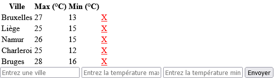

# Requirements
- PHP 8.0+ and server ([XAMPP](https://www.apachefriends.org/fr/index.html) prefered)
- MySQL (included in XAMPP)
- A database called "weather" containing a table named "meteo" with columns "city" (set it as primary key for a better user experience), "max" and "min"
- This repo ;)

# Launch
Open XAMPP then start the MySQL server (you may need to start the Apache server to access phpmyadmin). If you're working inside the XAMPP directory, you can start the Apache server as well. Otherwise, go to the root of this repository, open your terminal and use (_you may need to add xampp/php path to your environment variables first_) :
```sh
php -S localhost:PORT
```
_PORT can be any valid 4 digits number like `5000`_.

# API
- **/** is where you get on server start up 
- **index.php** loads everytime you submit the form (technically the same as **/**)
- **index.php?ville={}** loads when you delete a row

# Use
Here is what you should see when your start the server :



Otherwise, you should see the corresponding SQL error.

**!! Warning : the following website is written in French.**
